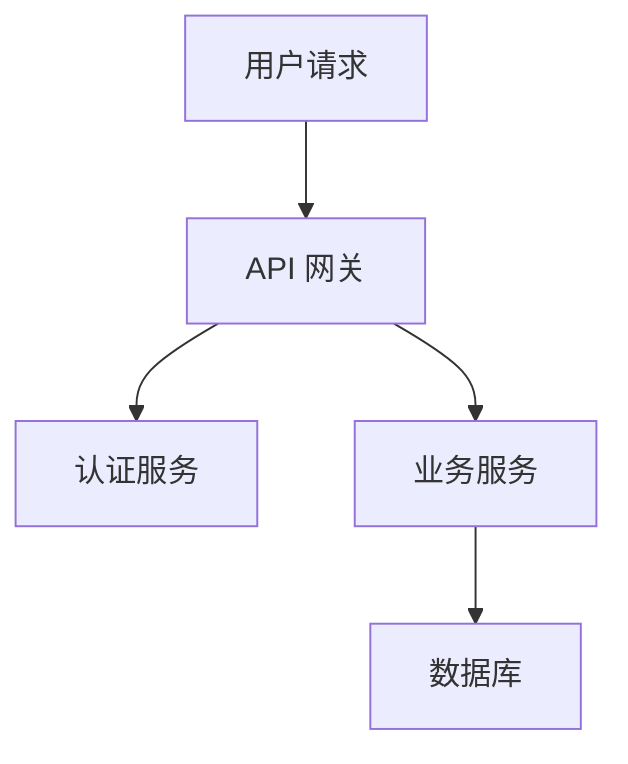

# 设计规划指南

## 设计流程

### 1. 现状分析

- 阅读现有代码架构
- 识别相关模块和接口
- 了解技术栈和约束

### 2. 架构设计

**必须包含 Mermaid 图**，至少一张：

### 3. 模块划分

每个模块需说明：
- 职责：这个模块做什么
- 接口：暴露哪些 API
- 依赖：依赖哪些其他模块

### 4. 数据模型

- 实体定义
- 字段说明
- 关系图（如适用）

### 5. 错误处理策略

- 错误分类：业务错误 vs 系统错误
- 错误码设计
- 错误传播路径

## 设计原则

- **YAGNI** — 不要过度设计，只做当前需要的
- **DRY** — 避免重复，提取公共逻辑
- **单一职责** — 每个模块只做一件事
- **接口隔离** — 暴露最少的接口

## 任务拆解原则

### 粒度标准

- 每个任务 15-30 分钟可完成
- 每个任务有明确的输入和输出
- 任务间依赖关系清晰

### 拆解方法

1. 按模块拆分：数据层 → 业务层 → 接口层
2. 按功能拆分：核心功能 → 边缘功能 → 优化
3. 按风险拆分：高风险先行验证

### 任务状态

- `[ ]` 未开始
- `[x]` 已完成
- `[-]` 已跳过
- `[!]` 阻塞

## 设计文档检查清单

- [ ] 架构图清晰表达模块关系
- [ ] 每个模块职责明确
- [ ] 接口定义完整
- [ ] 数据模型合理
- [ ] 错误处理策略已考虑
- [ ] 任务拆解粒度合适
- [ ] 任务依赖关系正确
