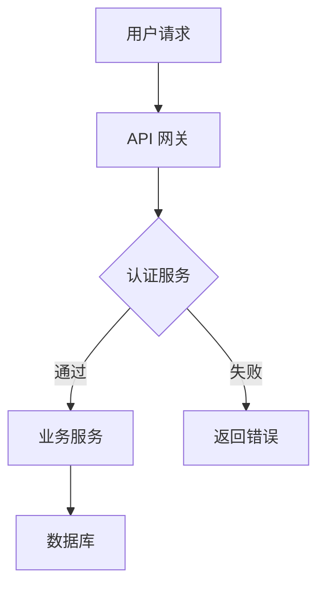
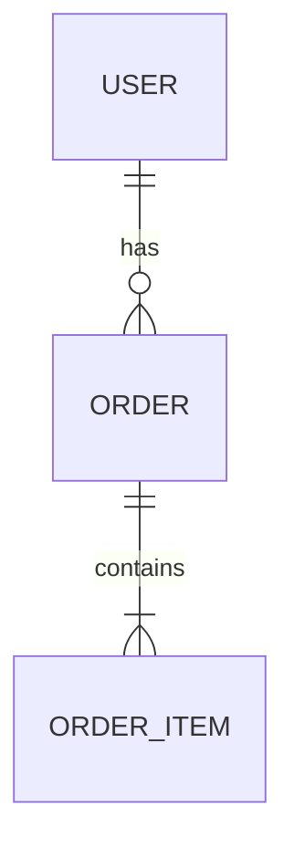
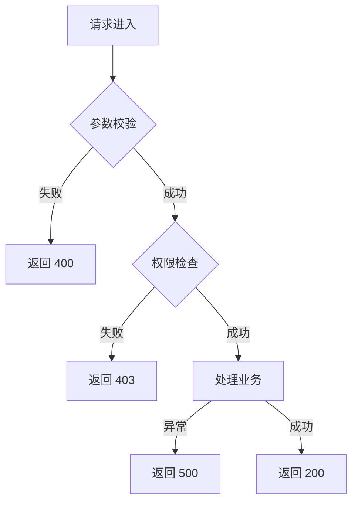

# {功能名称} — 设计文档

> Spec: `{YYYYMMDD-feature-name}`
> 阶段：设计规划
> 日期：{YYYY-MM-DD}
> 状态：待确认

## 1. 架构设计

### 1.1 整体架构

<!-- 提示：必须包含 Mermaid 图，描述模块间的关系 -->
<!-- - 哪些模块参与？ -->
<!-- - 请求/数据如何流转？ -->
<!-- - 模块间如何通信？（HTTP/RPC/消息队列） -->



### 1.2 架构说明

<!-- 提示：解释架构设计的思路和选型理由 -->
<!-- - 为什么选择这种架构风格？（单体/微服务/模块化） -->
<!-- - 为什么不用其他方案？（权衡取舍） -->
<!-- - 技术栈选型理由 -->

## 2. 模块设计

### 2.1 模块清单

<!-- 提示：列出所有参与的模块及其职责 -->

| 模块 | 职责 | 依赖 |
|------|------|------|
| {模块名} | {一句话说明做什么} | {依赖哪些其他模块} |

### 2.2 模块详细设计

<!-- 提示：对每个核心模块，说明其接口和实现 -->

#### 模块：{模块名}

**职责**：{这个模块做什么，解决什么问题}

**接口**：

<!-- 提示：示例为 Python 语法，按项目技术栈替换（TypeScript interface / Go interface / Java interface 等） -->

```python
# 提示：定义对外暴露的核心接口（Port）
# - 方法名要清晰表达意图
# - 参数类型要明确
# - 返回值要包含成功和失败情况

class ModuleName(Protocol):
    async def method_name(self, param: str) -> Result:
        ...
```

## 3. 数据模型

### 3.1 实体定义

<!-- 提示：定义涉及的数据实体 -->
<!-- 提示：示例为 Python dataclass，按项目技术栈替换 -->
<!-- - 字段名和类型 -->
<!-- - 哪些字段是必填的？ -->
<!-- - 哪些字段需要索引？ -->

```python
@dataclass
class EntityName:
    id: str                # 唯一标识
    field1: str            # {说明}
    field2: int            # {说明}
    created_at: datetime   # 创建时间
    updated_at: datetime   # 更新时间
```

### 3.2 关系图

<!-- 提示：用 ER 图描述实体间的关系 -->
<!-- - 一对一 / 一对多 / 多对多 -->
<!-- - 哪些字段是外键？ -->



## 4. 接口设计

### 4.1 API 列表

<!-- 提示：列出所有对外暴露的接口 -->
<!-- 提示：如项目无 HTTP API，改为 CLI 命令 / 事件 / 消息 / 函数签名等接口约定 -->
<!-- - 方法和路径要符合 RESTful 规范 -->
<!-- - 明确请求体和响应体结构 -->

| 方法 | 路径 | 说明 | 请求体 | 响应体 |
|------|------|------|--------|--------|
| POST | /api/{resource} | 创建{资源} | {字段列表} | {返回字段} |
| GET | /api/{resource}/:id | 查询单个{资源} | — | {返回字段} |

### 4.2 请求/响应示例

<!-- 提示：给出完整的请求和响应示例 -->

```json
// 请求
{
  "field1": "value",
  "field2": 123
}

// 响应 200
{
  "id": "xxx",
  "field1": "value",
  "createdAt": "2026-07-12T10:00:00Z"
}
```

## 5. 错误处理

### 5.1 错误码设计

<!-- 提示：定义业务错误码，每个错误码要有唯一含义 -->

| 错误码 | HTTP 状态码 | 说明 |
|--------|------------|------|
| {ERROR_CODE_1} | 400 | {参数错误的具体场景} |
| {ERROR_CODE_2} | 401 | {认证失败的具体场景} |
| {ERROR_CODE_3} | 403 | {权限不足的具体场景} |
| {ERROR_CODE_4} | 404 | {资源不存在的具体场景} |
| {ERROR_CODE_5} | 500 | {服务器内部错误} |

### 5.2 错误处理流程

<!-- 提示：用流程图描述错误如何传播和处理 -->



## 6. 技术选型

<!-- 提示：列出关键组件的选型和理由 -->

| 组件 | 选型 | 理由 |
|------|------|------|
| {组件类型，如"HTTP 客户端"} | {选型，如"axios"} | {为什么选这个} |
