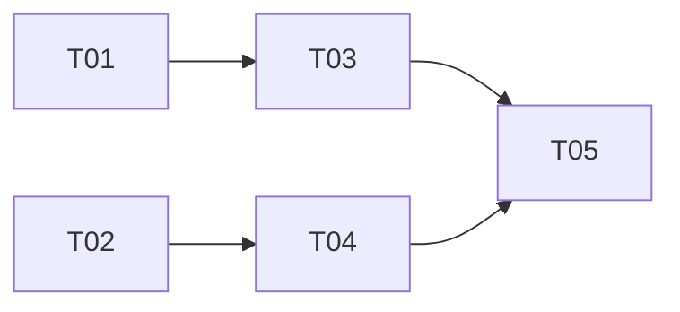

# {功能名称} — 实现计划

> Spec: `{YYYYMMDD-feature-name}`
> 阶段：设计规划
> 日期：{YYYY-MM-DD}
> 状态：待确认

## 任务清单

<!-- 提示：根据 02-design.md 的模块设计拆解任务 -->
<!-- 提示：每个任务 15-30 分钟可完成 -->
<!-- 提示：按阶段分组，标注优先级和依赖关系 -->
<!-- 提示：TDD 流程：先写测试 → 写代码 → 重构 -->

### 阶段一：{阶段名称，如"基础设施"}

<!-- 提示：基础准备工作，如数据库迁移、工具封装、脚手架搭建 -->

| 序号 | 任务 | 优先级 | 预估时间 | 状态 |
|------|------|--------|----------|------|
| T01 | {具体任务描述，如"创建 user 表，包含 id/nickname/avatar 字段"} | P0 | {N}min | [ ] |
| T02 | {具体任务描述} | P0 | {N}min | [ ] |

### 阶段二：{阶段名称，如"核心功能"}

<!-- 提示：核心业务逻辑实现 -->

| 序号 | 任务 | 优先级 | 预估时间 | 状态 |
|------|------|--------|----------|------|
| T03 | {具体任务描述，如"实现 AuthService.login() 方法"} | P0 | {N}min | [ ] |
| T04 | {具体任务描述} | P0 | {N}min | [ ] |

### 阶段三：{阶段名称，如"辅助功能"}

<!-- 提示：辅助功能、边缘功能、优化等 -->

| 序号 | 任务 | 优先级 | 预估时间 | 状态 |
|------|------|--------|----------|------|
| T05 | {具体任务描述} | P1 | {N}min | [ ] |

### 阶段四：{阶段名称，如"前端/UI"}

<!-- 提示：如果有前端需求，在此分组 -->

| 序号 | 任务 | 优先级 | 预估时间 | 状态 |
|------|------|--------|----------|------|
| T06 | {具体任务描述} | P1 | {N}min | [ ] |

## 依赖关系

<!-- 提示：用 Mermaid 图或文字说明任务间的依赖 -->
<!-- - 哪些任务必须先完成？ -->
<!-- - 哪些任务可以并行？ -->

## 状态说明

- `[ ]` 未开始
- `[x]` 已完成
- `[-]` 已跳过（注明原因）
- `[!]` 阻塞（注明原因）
